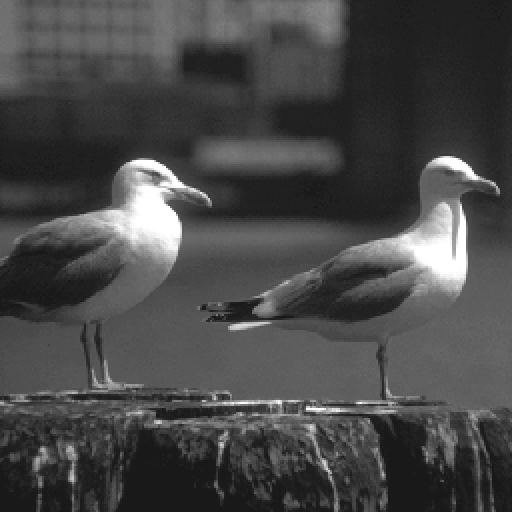
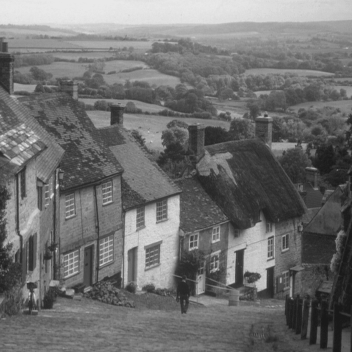
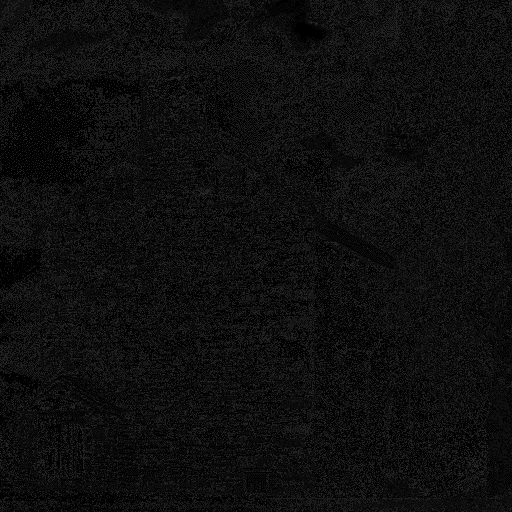
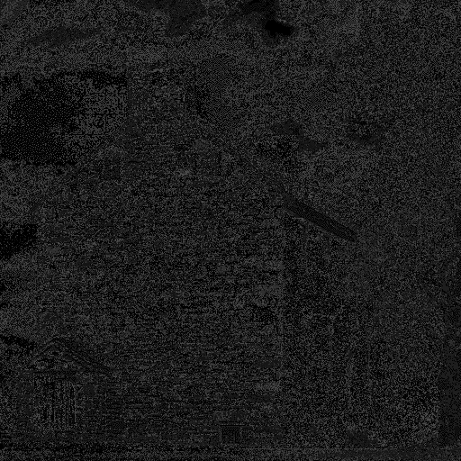
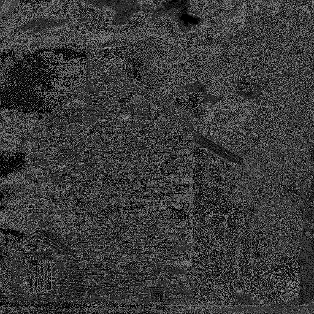
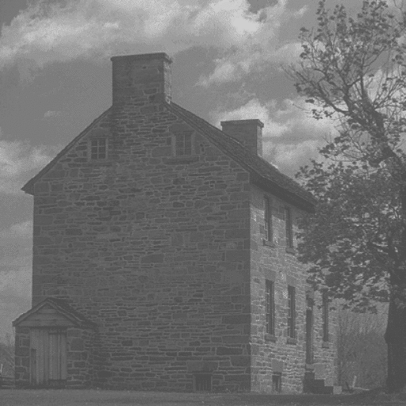
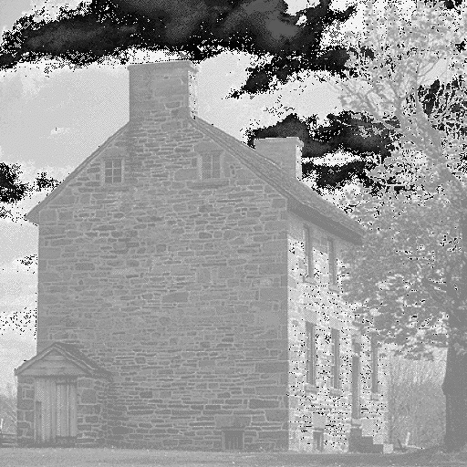
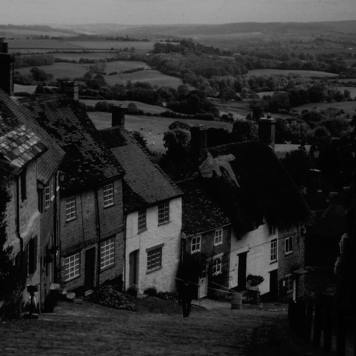
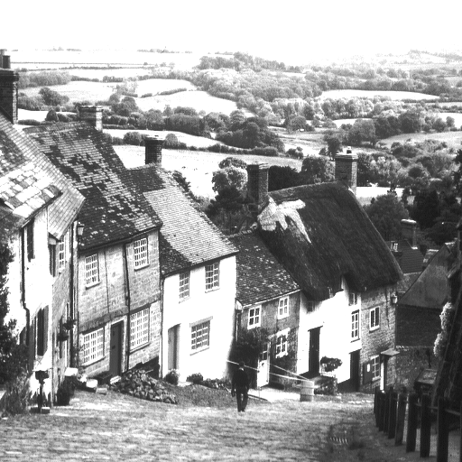
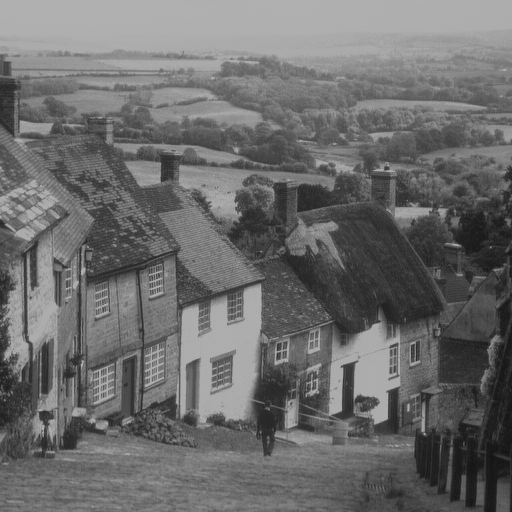

# Trabalho 1 - Introdução ao Processamento de Imagens Digitais

### Nome

Victor Palmerini

### RA

178061

### Data

01/04/2020

## Introdução

Este é o Trabalho 1 da disciplina _**MC920** - Introdução ao Processamento de Imagens Digitais_ da **Unicamp** - Universidade Estadual de Campinas.

O principal objetivo deste trabalho é desenvolver uma boa noção sobre alguns dos mais básicos processamentos de imagens digitais como: manipulação da resolução, quantização e escala de cinza.

O trabalho requer por parte do aluno um conhecimento básico da linguagem de programação `python` e bibliotecas que facilitem a manipulação das imagens digitais bem como seus processamentos. No caso deste trabalho, foram usados os pacotes `numpy`, `pillow` e `jupyter notebook`. Estes pacotes serão mencionados com mais detalhes no decorrer do relatório.

## Desenvolvimento

### Estrutura do Projeto

1. `/notebooks` - é a pasta que contém os notebooks com os algoritmos para serem executados pelo `jupyter notebook`

2. `requirements.txt` - é um arquivo texto que contém as dependências para executar a aplicação (foi gerado pelo pacote `pip` através do comando `pip freeze > requirements.txt`)

3. `Pipfile` e `Pipfile.lock` - são os arquivos relacionados ao `ambiente virtual` aonde as dependências são instaladas e executadas. Isso permite que as dependências sejam instaladas apenas no ambiente virtual e não no ambiente local.

4. `/images` - pasta com algumas imagens usadas como entrada para execução dos notebooks

### Rodando Localmente

#### Dependências

Para executar os notebooks é necessário instalar as seguintes dependências:

1. `Python 3` - neste projeto foi usada a versão `3.7.3`. Qualquer versão do `python` a partir da `3` é suficiente.

2. `Pipenv` - gerenciador de ambientes virtuais. É equivalente ao `virtualenv`.

#### Inicialização do Ambiente

Na pasta root do projeto, execute os seguintes comandos em uma `shell`:

1. `pipenv shell` - para iniciar um ambiente virtual localmente

2. `pipenv install -r requirements.txt` - instala no ambiente virtual todas as dependências listadas no arquivo `requirements.txt`

#### Executando os notebooks

Para executar os notebooks, há 2 caminhos:

1. Executar `jupyter notebook` em uma `shell` para subir um servidor do `jupyterlab` que vai abrir automaticamente o navegador padrão com o ambiente `jupyter` e as pastas e arquivos do projeto.

2. Caso o projeto tenha sido aberto no `Visual Studio Code`, é possível subir o servidor do `jupyterlab` executando a task `Start Notebook`. Uma outra opção é instalar a extensão `VS Code Jupyter Notebook`, que permite executar os notebooks no próprio `VS Code`.

#### Entradas

As entradas dos notebooks serão o `path` da imagem de entrada, o `path` da **pasta** de saída e algum ou alguns outros parâmetros necessários para a execução do processamento. As imagens de entrada utilizadas são _monocromáticas_, no formato `.png` e com 256 níveis de intensidade. Como foi falado, na pasta `/images` há algumas imagens que podem ser usadas como entrada.

#### Saídas

As saídas também serão imagens _monocromáticas_, no formato `.png` e com um número de níveis de intensidade que pode ser diferente de 256 dependendo do processamento aplicado. Alguns notebooks irão gerar mais de uma imagem como saída. Isto será especificado no momento de execução do notebook.

### Implementação dos Processamentos

#### Diminuição da Resolução

Este processamento, implementado no notebook `resolution.ipynb`, consiste em diminuir a densidade de pixels numa imagem digital. Isto pode ser feito diminuindo o número de pixels de uma imagem mas mantendo as suas dimensões, dessa forma o número de pixels por unidade de espaço diminui.

Em termos de implementação, este processamento consiste em transformar cada bloco de 4 pixels da matriz que representa a imagem em blocos de 1 pixel. O método mais comum consiste em obter a média aritmética dos 4 valores de intensidade de cada pixel e atribuir pro pixel resultante. Após isso, a matriz resultante terá a metade da altura e a metade da largura, portanto terá 4x menos elementos. Como o tamanho da imagem deve ser preservado, basta redimensionar a matriz para o tamanho original.

Explicando o código com o algoritmo citado em mais detalhes:

1. Primeiro obtém-se as entradas:

   - `path` da imagem de entrada (ex: `../images/city.png`)
   - `path` da pasta de saída (este notebook pode gerar várias imagens de saída) - (ex: `../outputs`, a pasta `/outputs` deve existir)
   - nº de imagens de saída (cada imagem de saída terá a metade da resolução em relação à imagem anterior)

2. Supondo que se quer `k` imagens de saída, para cada iteração a imagem de entrada é redimensionada para metade do tamanho (altura e largura) da imagem anterior. Feito isso, a imagem é redimensionada novamente para o tamanho original. Para este processamento utilizou-se a função `resize()` da biblioteca `Pillow` com o parâmetro `resample=Image.BOX`. Este parâmetro considera os pixels da imagem original com pesos iguais para gerar o pixel resultante da imagem de saída.

3. Salva-se cada imagem de saída no formato `.png` e com o mesmo tamanho da imagem original na pasta de saída especificada. Os nomes das imagens seguirão o padrão `reduced{k}.png`, onde `k²` é o número de pixels que a imagem possui depois da transformação.

Exemplo:

- Imagem de Entrada: `../images/baboon.png`
- Path de Saída: `../outputs/resolution`
- Nº de Saídas (k): `6`

_Imagem Original **512x512** Pixels_

_Imagem **256x256** Pixels_

_Imagem **128x128** Pixels_

_Imagem **64x64** Pixels_

_Imagem **32x32** Pixels_

_Imagem **16x16** Pixels_

_Imagem **8x8** Pixels_

#### Diminuição da Quantização

A quantização de uma imagem está relacionada aos níveis de intensidade da imagem digital. Se uma imagem possui 256 níveis de intensidade então ela possui 8 planos de bit, pois os valores de intensidade podem ser representados em 8 bits. Conforme se diminui o número de bits pra representação da intensidade, o número de valores possíveis também diminiu.

Em termos de implementação, este processamento, implementado no notebook `quantize.ipynb`, consiste em diminuir o número de bits necessários pra representar a intensidade de cinza da imagem monocromática. Este número é então diminuído pela metade a cada iteração ou, em outras palavras, a representação em bits é "shiftada" pra esquerda. Desta forma, a imagem possui cada vez menos valores possíveis para representar os níveis de cinza.

Explicando o código com o algoritmo citado em mais detalhes:

1. Primeiro obtém-se as entradas:

   - `path` da imagem de entrada
   - `path` da pasta de saída (este notebook pode gerar várias imagens de saída) - (ex: `../outputs`, a pasta `/outputs` deve existir)
   - nº de imagens de saída (cada imagem de saída terá a metade da resolução em relação à imagem anterior)

2. Supondo que se quer `k` imagens de saída, para cada iteração a imagem de entrada tem o número total de possíveis níveis de cinza diminuído pela metade. Utilizou-se para esse processamento a função `quantize()` da biblioteca `Pillow`. Esta função altera então o número de níveis de cinza que a imagem pode ter, tanto aumentando quanto diminuindo este número (que é o caso deste trabalho).

3. Salva-se cada imagem de saída no formato `.png` e com o mesmo tamanho da imagem original na pasta de saída especificada. Os nomes das imagens seguirão o padrão `quantize{k}.png`, onde `k` é o número de níveis de intensidade que a imagem possui depois da transformação.

Exemplo:

- Imagem de Entrada: `../images/baboon.png`
- Path de Saída: `../outputs/quantize`
- Nº de Saídas (k): `8`

_Imagem Original **256** Níveis_

_Imagem **128** Níveis_

_Imagem **64** Níveis_

_Imagem **32** Níveis_

_Imagem **16** Níveis_

_Imagem **8** Níveis_

_Imagem **4** Níveis_

_Imagem **2** Níveis_

_Imagem **1** Nível_

#### Transformações na Escala de Cinza

É possível aplicar filtros em imagens digitais a partir de transformações lineares nos valores que representam a intensidade de cinza da imagem. Estas transformações podem deixar a imagem mais clara, mais escura ou com mais ou menos contraste, por exemplo.

##### 1. Transformação Logarítmica

A transformação logarítmica tem por objetivo deixar a imagem mais clara, realçando os níveis de cinza que possuem maior intensidade.

Sua implementação (`/gray_scale/log.ipynb`) é feita aplicando-se a seguinte função `g = c * log(f + 1)` para todos os pixels da imagem original.

- `f` é o valor da intensidade de cinza
- `c` é uma constante arbitrária

O notebook consiste em:

1. Obter-se as entradas:

   - `path` da imagem de entrada
   - `path` da pasta de saída (ex: `../outputs`, a pasta `/outputs` deve existir)
   - constante `c` usada para aumentar ou diminuir o efeito da transformação

2. Aplica-se a transformação através da função `g` em todos os pixels da imagem de entrada.

3. Gera-se a imagem de saída com a transformação aplicada e esta é salva na pasta de saída especificada e com a imagem nomeada como `log.png`.

Exemplo:

- Imagem de Entrada: `../images/baboon.png`
- Path de Saída: `../outputs/log`
- Constante `c`: `2`

_Imagem Original **função f**_

_Imagem **função g(f)**_

##### 2. Transformação Exponencial

A transformação exponencial tem por objetivo deixar a imagem mais escura, realçando os níveis de cinza que possuem menor intensidade.

Sua implementação (`/gray_scale/exp.ipynb`) é feita aplicando-se a seguinte função `g = c * e^f` para todos os pixels da imagem original.

- `f` é o valor da intensidade de cinza
- `c` é uma constante arbitrária

O notebook consiste em:

1. Obter-se as entradas:

   - `path` da imagem de entrada
   - `path` da pasta de saída (ex: `../outputs`, a pasta `/outputs` deve existir)
   - constante `c` usada para aumentar ou diminuir o efeito da transformação

2. Aplica-se a transformação através da função `g` em todos os pixels da imagem de entrada.

3. Gera-se a imagem de saída com a transformação aplicada e esta é salva na pasta de saída especificada e com a imagem nomeada como `exp.png`.

Exemplo:

- Imagem de Entrada: `../images/baboon.png`
- Path de Saída: `../outputs/exp`
- Constante `c`: `2`

_Imagem Original **função f**_

_Imagem **função g(f)**_

##### 3. Transformação Quadrática

A transformação quadrática tem por objetivo deixar a imagem mais escura (mais ainda que a exponencial), realçando os níveis de cinza que possuem menor intensidade.

Sua implementação (`/gray_scale/quadratic.ipynb`) é feita aplicando-se a seguinte função `g = c * f^2` para todos os pixels da imagem original.

- `f` é o valor da intensidade de cinza
- `c` é uma constante arbitrária

O notebook consiste em:

1. Obter-se as entradas:

   - `path` da imagem de entrada
   - `path` da pasta de saída (ex: `../outputs`, a pasta `/outputs` deve existir)
   - constante `c` usada para aumentar ou diminuir o efeito da transformação

2. Aplica-se a transformação através da função `g` em todos os pixels da imagem de entrada.

3. Gera-se a imagem de saída com a transformação aplicada e esta é salva na pasta de saída especificada e com a imagem nomeada como `quadratic.png`.

Exemplo:

- Imagem de Entrada: `../images/baboon.png`
- Path de Saída: `../outputs/quadratic`
- Constante `c`: `2`

_Imagem Original **função f**_

_Imagem **função g(f)**_

##### 4. Transformação Raiz Quadrada

A transformação raiz quadrada tem por objetivo deixar a imagem mais clara (menos que a logarítmica), realçando os níveis de cinza que possuem maior intensidade.

Sua implementação (`/gray_scale/square_root.ipynb`) é feita aplicando-se a seguinte função `g = c * sqrt(f)` para todos os pixels da imagem original.

- `f` é o valor da intensidade de cinza
- `c` é uma constante arbitrária

O notebook consiste em:

1. Obter-se as entradas:

   - `path` da imagem de entrada
   - `path` da pasta de saída (ex: `../outputs`, a pasta `/outputs` deve existir)
   - constante `c` usada para aumentar ou diminuir o efeito da transformação

2. Aplica-se a transformação através da função `g` em todos os pixels da imagem de entrada.

3. Gera-se a imagem de saída com a transformação aplicada e esta é salva na pasta de saída especificada e com a imagem nomeada como `square_root.png`.

Exemplo:

- Imagem de Entrada: `../images/baboon.png`
- Path de Saída: `../outputs/square_root`
- Constante `c`: `2`

_Imagem Original **função f**_

_Imagem **função g(f)**_

##### 5. Transformação do Contraste

A transformação de contraste tem por objetivo manipular o contraste da imagem, isto é, aumentar ou diminuir a diferença entre os valores de intensidade de cinza da imagem.

Sua implementação (`/gray_scale/contrast.ipynb`) é feita aplicando-se a seguinte função para todos os pixels da imagem original:

```
g = (alpha * f), se 0 <= f <= a
g = (betha * (f - a)) + (alpha * a), se a < f <= b
g = (gamma * (f - b)) + (betha * (b - a) + alpha * a), se b < f <= L
```

Onde:

- `f` é o valor da intensidade de cinza
- `L` é o número total de níveis possíveis (em geral 256)
- `a` e `b` são valores arbitrários entre 0 e `L`
- `alpha`, `betha` e `gamma` são constante arbitrárias usadas pra aumentar ou diminuir o efeito da transformação

O notebook consiste em:

1. Obter-se as entradas:

   - `path` da imagem de entrada
   - `path` da pasta de saída (ex: `../outputs`, a pasta `/outputs` deve existir)
   - constante `L` que representa o número de níveis possíveis na imagem
   - constantes `a` e `b` usados para definir os intervalos em que será aplicada a transformação com diferentes efeitos pra cada intervalo
   - constantes `alpha`, `betha` e `gamma` usadas para aumentar ou diminuir o efeito da transformação pra cada intervalo

2. Aplica-se a transformação através da função `g` em todos os pixels da imagem de entrada.

3. Gera-se a imagem de saída com a transformação aplicada e esta é salva na pasta de saída especificada e com a imagem nomeada como `contrast.png`.

Exemplo:

- Imagem de Entrada: `../images/baboon.png`
- Path de Saída: `../outputs/contrast`
- Parâmetros:
  - `c`: `2`
  - `L`: `256`
  - `a`: `30`
  - `b`: `230`
  - `alpha`: `0.2`
  - `betha`: `0`
  - `gamma`: `0.5`

_Imagem Original **função f**_

_Imagem **função g(f)**_

## Análise

#### Diminuição da Resolução

Analisando o comportamento da transformação de diminuir a resolução, percebe-se que a cada iteração, isto é, a cada diminuição pela metade do número de pixels, a imagem fica com uma definição cada vez menor.

Conclui-se então que a resolução de uma imagem digital está diretamente relacionada à quantidade de pixels que ela possui dado um espaço (altura x largura) constante. Além disso o tamanho da imagem, em bytes, também diminui, já que agora há menos informação contida na imagem. Consegue-se então diminuir consideravelmente o tamanho da imagem (em bytes) mas sem perder tanta qualidade caso se considere poucas reduções, como é exemplificado abaixo:

_Imagem Original (512x512 Pixels) - **100.1 kB**_

_Imagem 256x256 Pixels - **47.2 kB**_

#### Quantização

Analisando o comportamento da transformação de quantização, percebe-se que a cada iteração, isto é, a cada diminuição pela metade do número de bits pra representar a intensidade de cinza, a imagem tem menos cores. Isso fica bem nítido nos casos em que a imagem tem 2 bits (4 cores) ou menos pra representar as intensidades.

Comparando-se os tamanhos (em bytes) dessas imagens, percebe-se que a imagem representada com 4 bits, por exemplo, possui praticamente a metade do tamanho da imagem original (8 bits). E ainda assim possui uma qualidade muito parecida com a imagem original (considerando as características das imagens usadas como entrada para este projeto).

Conclui-se então que este é um bom método para diminuir o tamanho de uma imagem monocromática, por exemplo, sem que esta perca muita qualidade no processo.

_Imagem Original (256 Níveis) - **220.1 kB**_

_Imagem 128 Níveis - **47.2 kB**_

#### Transformação Logarítmica

Analisando o comportamento da transformação logarítmica, percebe-se que a imagem fica mais clara com os valores adequados pra constante `c`. Atribuindo valores positivos baixos a `c`, como `1` ou `2`, não consegue-se visualizar a imagem pois os níveis de cinza ainda ficam muito baixos, já que a transformação com a função logarítmica diminui bastante esses valores.

Pode-se então aumentar o valor de `c` o quanto se queira pra deixar a imagem mais clara. Segue algumas imagens com diferentes valores de `c`.

_Imagem Original_

_Imagem Transformação log com `c = 10`_

_Imagem Transformação log com `c = 20`_

_Imagem Transformação log com `c = 30`_

#### Transformação com Raiz Quadrada

Analisando o comportamento da transformação com raiz quadrada, percebe-se que a imagem fica mais clara com os valores adequados pra constante `c`. Esta transformação é parecida com a transformação logarítmica, no sentido de que aplica o mesmo efeito, porém a intensidade deste efeito é maior aqui, já que a função de raiz quadrada não diminui tanto os valores de intensidade quanto a função logarítmica.

Atribuindo valores positivos baixos a `c`, como `1` ou `2`, não consegue-se visualizar a imagem pois os níveis de cinza ainda ficam um pouco baixos, já que a transformação com a função de raiz quadrada diminui consideravelmente esses valores.

Pode-se então aumentar o valor de `c` o quanto se queira pra deixar a imagem mais clara. Segue algumas imagens com diferentes valores de `c`.


_Imagem Original_

_Imagem Transformação raiz quadrada com `c = 10`_

_Imagem Transformação raiz quadrada com `c = 20`_

_Imagem Transformação raiz quadrada com `c = 30`_

#### Transformação Quadrática

Analisando o comportamento da transformação quadrática, percebe-se que a imagem fica mais escura com os valores adequados pra constante `c`.

Atribuindo valores positivos baixos a `c`, como `0.1` ou `0.2`, não consegue-se visualizar a imagem pois os níveis de cinza ainda ficam um pouco baixos, já que a transformação com a função quadrática diminui consideravelmente esses valores. Além disso a imagem ficou com uma aparência diferente e perdeu os traços originais. A razão disso acontecer não foi descoberta com clareza.

Em relação aos níveis de intensidade, pode-se então aumentar o valor de `c` o quanto se queira pra deixar a imagem mais clara. Segue algumas imagens com diferentes valores de `c`.

_Imagem Original_

_Imagem Transformação quadrática com `c = 0.15`_

_Imagem Transformação quadrática com `c = 0.3`_

_Imagem Transformação quadrática com `c = 0.6`_

#### Transformação Exponencial

Analisando o comportamento da transformação exponencial, percebe-se que a imagem fica mais escura com os valores adequados pra constante `c`.

Atribuindo valores positivos baixos a `c`, como `0.1` ou `0.2`, percebe-se um escurecimento bem considerável da imagem, já que a transformação com a função exponencial aumenta muitos os valores de intensidade, porém a função é normalizada para o intervalo [0,1] pra justamente evitar essa situação.

Pode-se então alterar o valor de `c` o quanto se queira pra deixar a imagem mais clara (aumentando `c`) ou mais escura (diminuindo `c`). Segue algumas imagens com diferentes valores de `c`.

Percebe-se na última imagem que os valores muito altos, próximos do branco, ultrapassaram o valor máximo de `255` e acabaram virando valores baixos, bem próximos do preto. Por isso essa diferença em relação às outras imagens.

_Imagem Original_

_Imagem Transformação exponencial com `c = 0.1`_

_Imagem Transformação exponencial com `c = 0.3`_

_Imagem Transformação exponencial com `c = 0.5`_

#### Transformação do Contraste

Analisando o comportamento da transformação de contraste, percebe-se que a imagem pode ficar com um contraste maior ou menor dependendo dos valores dos parâmetros `a`, `b`, `alpha`, `betha` e `gamma`.

A função de contraste se comporta de uma forma diferente em relação às outras funções deste trabalho. Isso porque ela divide o intervalo de níveis em 3 blocos e aplica um efeito de realce maior ou menor pra esses blocos de acordo com os valores dos parâmetros citados.

Os parâmetros `a` e `b` são os responsáveis por definir o "tamanho" de cada um dos 3 blocos e os parâmetros `alpha`, `betha` e `gamma` são os responsáveis por realçar mais ou menos a intensidade do 1º ([0,a]), 2º ([a,b]) e 3º ([b,255]) blocos respectivamente.

Nas imagens abaixo mantém-se os valores de `a` e `b` constantes em todas as imagens e com valores de forma que dividam o intervalo de intensidades em blocos de tamanho similares. Desta forma conseguimos notar a diferença em relação aos parâmetros `alpha`, `betha` e `gamma`.

```
L = 256
a = 80
b = 170
```

_Imagem Original_

_Imagem Transformação de Contraste com `alpha = 0.1, beta = 1 e gamma = 1`_

_Imagem Transformação de Contraste com `alpha = 1, beta = 3 e gamma = 1`_

_Imagem Transformação de Contraste com `alpha = 1, beta = 1 e gamma = 0.1`_

## Limitações

Os resultados obtidos neste trabalho se aplicam e se limitam às imagens quadradas, monocromáticas ou coloridas e no formato `.png` ou `.jpg`.

Isto se deve principalmente aos tipos de processamentos implementados e às limitações das bibliotecas utilizadas.

## Bibliografia

1. Documentação das bibliotecas usadas
   - [Pillow](https://pillow.readthedocs.io/en/stable/)
   - [NumPy](https://docs.scipy.org/doc/numpy/reference/)
   - [Jupyter Notebook](https://jupyter-notebook.readthedocs.io/en/stable/)
2. _R.C. Gonzalez, R.E. Woods. Digital Image Processing. Prentice Hall, 2007_.
3. Material de aula fornecido pelo Professor
